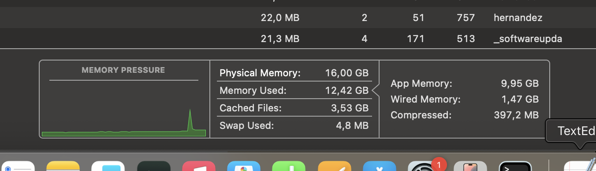
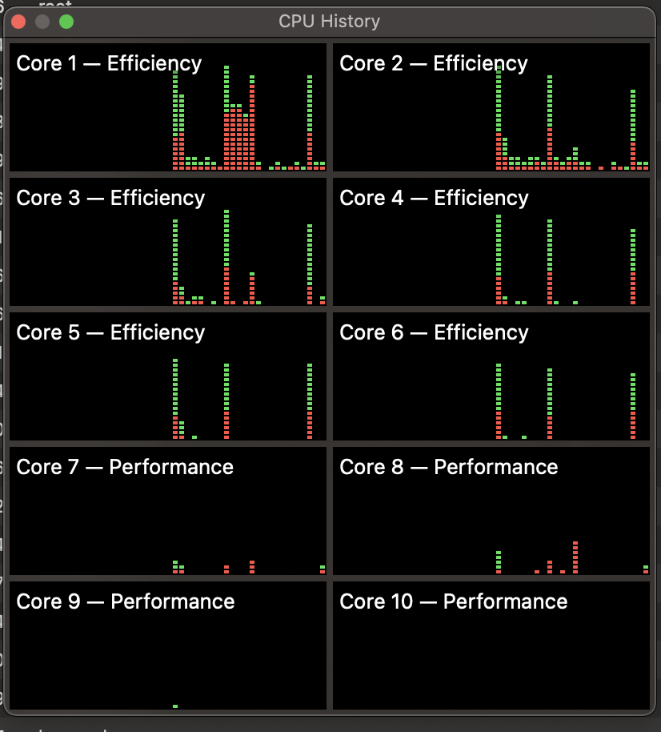
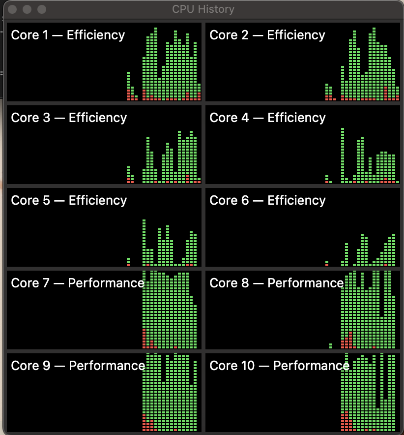
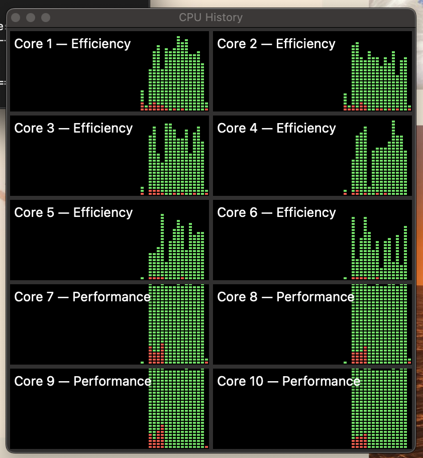
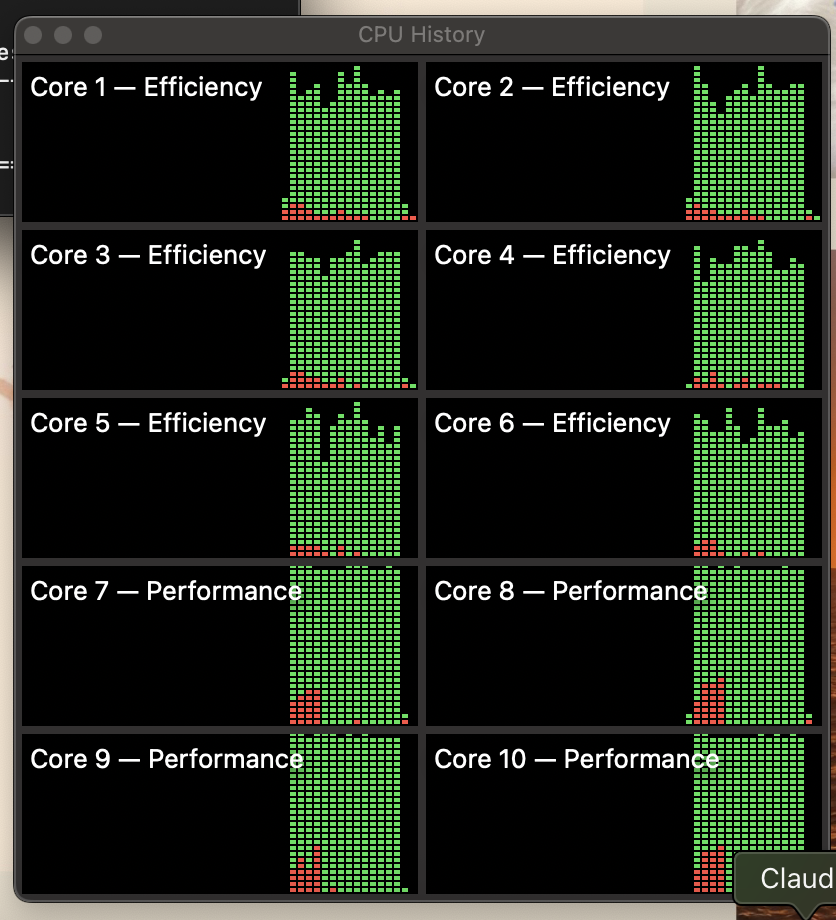

# Evaluación de Rendimiento de una Plataforma de Cómputo de Alto Rendimiento mediante HPL

**Gabriela Hernández Roncancio**
`MasFLOPSQueCabras`

| | |
|---|---|
| **Plataforma evaluada:** | Apple MacBook Air, chip M4, 16 GB RAM |
| **Sistema operativo:** | macOS Sequoia |
| **Fecha:** | 9 de julio de 2026 |

---

## Tabla de contenidos

1. [Introducción](#introducción)
2. [Especificaciones de la Máquina](#especificaciones-de-la-máquina)
3. [Proceso de Compilación](#proceso-de-compilación)
4. [Ejecución de HPL](#ejecución-de-hpl)
5. [Análisis de Rendimiento](#análisis-de-rendimiento)
6. [Discusión: Factores que limitan el rendimiento](#discusión-factores-que-limitan-el-rendimiento)
7. [Conclusiones](#conclusiones)

---

## Introducción

El presente informe documenta el proceso de instalación, compilación y ejecución del benchmark **HPL (High Performance Linpack)** sobre una plataforma de cómputo nativa Apple Silicon (chip M4). El objetivo es evaluar el rendimiento empírico de la máquina, compararlo con su rendimiento teórico máximo y analizar los factores que influyen en la eficiencia del sistema.

## Especificaciones de la Máquina

### Hardware

**Tabla 1.** Especificaciones de hardware de la plataforma evaluada

| Componente | Descripción |
|---|---|
| Modelo | Apple MacBook Air (2024) |
| Procesador | Apple M4 |
| Núcleos físicos | 10 (4 de rendimiento + 6 de eficiencia) |
| Núcleos lógicos | 10 (sin hyperthreading) |
| Memoria RAM | 16 GB unificada |
| Arquitectura | ARM64 (Apple Silicon) |

Lo anterior de acuerdo con las especificaciones técnicas oficiales de Apple[^1] y lo verificado mediante los siguientes comandos en terminal.

```bash
sysctl -n hw.logicalcpu 
sysctl -n hw.physicalcpu
system_profiler SPHardwareDataType
```

El chip M4 integra además una GPU de 10 núcleos, sin embargo, el benchmark HPL ejecuta sus operaciones computacionales estrictamente sobre la CPU. Por lo tanto, esta queda fuera del alcance de este informe.


Complementando lo anterior, el chip M4 incorpora el coprocesador **AMX (Apple Matrix coProcessor)**, dedicado exclusivamente a operaciones matriciales de álgebra lineal densa. El acceso a AMX solo se puede aprovechar a través de funciones específicas de **Apple Accelerate** (BLAS, LAPACK, vDSP), que es la librería usada en este informe para las operaciones matriciales de HPL[^1]. El M4 usa memoria unificada tipo LPDDR5X a 7500 MT/s con un bus de 128 bits, que indica gran eficacia en la transferencia de datos. Por último, cuenta con un *Neural Engine* (NPU) de 16 núcleos optimizado para IA que alcanza los 38 TOPS.[^2]

[^1]: [Apple Developer Documentation (Accelerate)](https://developer.apple.com/documentation/accelerate)
[^2]: [Apple newsroom M4](https://www.apple.com/co/newsroom/2024/05/apple-introduces-m4-chip/)

### Software

Para instalar las dependencias base del entorno de cómputo (GCC y OpenMPI) en el equipo, se utilizó el gestor de paquetes Homebrew a través del siguiente comando:

```bash
brew install gcc open-MPI
```

**Tabla 2.** Especificaciones de software del entorno de compilación y ejecución

| Componente | Versión / Descripción |
|---|---|
| Sistema operativo | macOS Sequoia 15.x |
| Compilador C | `Apple Clang 17.0.0` (via mpicc) |
| Compilador Fortran | `mpifort` (GCC 16.1.0) |
| Implementación MPI | OpenMPI 5.0.9 (instalado vía Homebrew) |
| Librería BLAS | Apple Accelerate Framework (nativa del sistema) |
| Versión HPL | 2.3 (diciembre 2018) |
| Gestor de paquetes | Homebrew 4.x |

Al revisar las versiones de los compiladores, se evidenció que aunque se instaló GCC vía Homebrew, OpenMPI seleccionó automáticamente Apple Clang 17.0.0 como compilador C mediante `mpicc`. Apple Clang está optimizado específicamente para la arquitectura ARM64/Apple Silicon, lo cual contribuye al rendimiento obtenido. El compilador Fortran sí corresponde a GNU Fortran 16.1.0, ya que macOS no incluye compilador Fortran nativo.

Una vez más lo anterior fue verificado mediante los siguientes comandos en terminal.

```bash
mpicc --version
mpifort --version
mpirun --version
sw_vers
head -5 ~/hpl-proyecto/hpl-2.3/README
```

## Proceso de Compilación

### Instalación de dependencias

Como fue mencionado anteriormente, las dependencias necesarias se instalaron mediante Homebrew.

```bash
# Instalar compilador GCC y OpenMPI
brew install gcc open-mpi

# Hacer carpeta donde esta el proyecto.
mkdir ~/hpl-proyecto
cd ~/hpl-proyecto

# Descargar HPL 2.3 desde el repositorio oficial de Netlib
curl -O https://www.netlib.org/benchmark/hpl/hpl-2.3.tar.gz

# Descomprimir
tar -xzf hpl-2.3.tar.gz
cd hpl-2.3
```

### Archivo Make.MacSilicon

Posterior a la instalación de dependencias se revisó mediante el siguiente comando las plantillas disponibles para tomar como base para el Makefile.

```bash
ls setup
```

De esta forma, se utilizó como base el archivo `setup/Make.MacOSX_Accelerate` incluido en la distribución de HPL, adaptado para la arquitectura Apple Silicon. Este se encontraba de la siguiente manera:

```makefile
SHELL        = /bin/sh
CD           = cd
CP           = cp
LN_S         = ln -fs
MKDIR        = mkdir -p
RM           = /bin/rm -f
TOUCH        = touch

ARCH         = MacOSX_Accelerate

TOPdir       = $(HOME)/hpl
INCdir       = $(TOPdir)/include
BINdir       = $(TOPdir)/bin/$(ARCH)
LIBdir       = $(TOPdir)/lib/$(ARCH)


HPLlib       = $(LIBdir)/libhpl.a 

# MPdir        = /opt/intel/mpi/4.1.0
# MPinc        = -I$(MPdir)/include64
# MPlib        = $(MPdir)/lib64/libmpi.a

LAdir        =
LAinc        =
LAlib        = -framework Accelerate

F2CDEFS      = -DAdd_ -DF77_INTEGER=int -DStringSunStyle

HPL_INCLUDES = -I$(INCdir) -I$(INCdir)/$(ARCH)
HPL_LIBS     = $(HPLlib) $(LAlib) $(MPlib)

HPL_OPTS     = -DHPL_DETAILED_TIMING -DHPL_PROGRESS_REPORT

HPL_DEFS     = $(F2CDEFS) $(HPL_OPTS) $(HPL_INCLUDES)

CC       = mpicc-openmpi-mp
CCNOOPT  = $(HPL_DEFS)
CCFLAGS  = $(HPL_DEFS) -O3

LINKER       = $(CC)
LINKFLAGS    = $(CCFLAGS)

ARCHIVER     = ar
ARFLAGS      = cr
RANLIB       = ranlib
```

El nuevo Makefile se renombró a `Make.MacSilicon` y con base al Makefile anterior se realizaron los siguientes cambios (**resaltado en verde** las líneas modificadas):

```makefile
SHELL        = /bin/sh
CD           = cd
CP           = cp
LN_S         = ln -fs
MKDIR        = mkdir -p
RM           = /bin/rm -f
TOUCH        = touch

ARCH         = MacSilicon                                    # <- modificado

TOPdir       = $(HOME)/hpl-proyecto/hpl-2.3                  # <- modificado
INCdir       = $(TOPdir)/include
BINdir       = $(TOPdir)/bin/$(ARCH)
LIBdir       = $(TOPdir)/lib/$(ARCH)

HPLlib       = $(LIBdir)/libhpl.a 

MPdir        = /opt/homebrew                                 # <- modificado
MPinc        = -I$(MPdir)/include                            # <- modificado
MPlib        = $(MPdir)/lib/libmpi.dylib                     # <- modificado

LAdir        =
LAinc        =
LAlib        = -framework Accelerate

F2CDEFS      = -DAdd_ -DF77_INTEGER=int -DStringSunStyle

HPL_INCLUDES = -I$(INCdir)                                   # <- modificado
HPL_LIBS     = $(HPLlib) $(LAlib) $(MPlib)

HPL_OPTS     = -DHPL_DETAILED_TIMING -DHPL_PROGRESS_REPORT

HPL_DEFS     = $(F2CDEFS) $(HPL_OPTS) $(HPL_INCLUDES)

CC           = mpicc                                         # <- modificado
CCNOOPT      = $(HPL_DEFS)
CCFLAGS      = $(HPL_DEFS) -O3

LINKER       = mpifort                                       # <- modificado
LINKFLAGS    = $(CCFLAGS)

ARCHIVER     = ar
ARFLAGS      = cr
RANLIB       = ranlib
```

**Justificación de los cambios realizados:**

**ARCH:** Se cambió de `MacOSX_Accelerate` a `MacSilicon` para que coincida con el nombre asignado al archivo.

```makefile
ARCH = MacSilicon
```

**TOPdir:** Se actualizó a la ruta real donde se descomprimió HPL, de modo que los binarios generados se guarden en esa misma ubicación.

```makefile
TOPdir = $(HOME)/hpl-proyecto/hpl-2.3
```

**MPI:** La plantilla original tenía comentadas las variables de MPI. Se agregaron las rutas correctas para OpenMPI instalado vía Homebrew en Apple Silicon, donde Homebrew reside en `/opt/homebrew`.

```makefile
MPdir = /opt/homebrew
MPinc = -I$(MPdir)/include
MPlib = $(MPdir)/lib/libmpi.dylib
```

**HPL_INCLUDES:** Se corrigió para apuntar directamente a `include/`, ya que la plantilla original apuntaba a un directorio existente pero vacío, lo que causaba errores de compilación al buscar los headers de HPL.

```makefile
HPL_INCLUDES = -I$(INCdir)
```

**Librería BLAS:** Se mantuvo el uso de Apple Accelerate Framework[^3] en lugar de OpenBLAS u otra librería genérica dado que aprovecha internamente los núcleos AMX (Apple Matrix Coprocessor), unidades de hardware dedicadas a operaciones de álgebra lineal densa que operan en paralelo al CPU general.

```makefile
LAdir =
LAinc =
LAlib = -framework Accelerate
```

**Compiladores:** Se cambió el compilador C a `mpicc` (Homebrew) y el enlazador a `mpifort` debido a que Accelerate contiene funciones escritas en Fortran que requieren la resolución correcta de sus librerías internas.

### Comando de compilación

```bash
make arch=MacSilicon
```

La compilación exitosa generó el ejecutable en: `bin/MacSilicon/xhpl`

## Ejecución de HPL

Para el correcto análisis de la capacidad de cómputo de la máquina, el proceso se dividió en cinco fases. En cada fase se modificó el archivo `HPL.dat` ubicado en `hpl-2.3/bin/MacSilicon/`.

Las variables asociadas a los recursos de la máquina que fueron modificadas a lo largo de las pruebas fueron las siguientes:

- **N**: Tamaño de la matriz de prueba. HPL opera sobre matrices de punto flotante de doble precisión (IEEE 754), así cada elemento ocupa 8 bytes. Por lo tanto, una matriz de orden $N^2$ requiere $N^2 \times 8$ bytes de memoria RAM, esta información será de vital importancia en la fase 5.
- **NB**: Tamaño de bloque. Incide en la eficiencia de la memoria caché de la CPU para maximizar el rendimiento de las operaciones por segundo.
- **P × Q**: Distribución de procesos MPI en una cuadrícula de filas y columnas, donde siempre debe cumplirse que $P \times Q = \text{np}$.

Además de los parámetros recién mencionados, que fueron variados en cada una de las pruebas, se mantuvieron constantes las variables en el HPL.dat asociadas al algoritmo empleado como PFACT, RFACT, BCAST, DEPTH. Para estos parámetros, los siguientes fueron los valores asignados para todas las pruebas.

**Tabla 3.** Parámetros algorítmicos fijos en todas las ejecuciones

| Parámetro | Valor | Descripción |
|---|---|---|
| PMAP | 0 | Row-major process mapping |
| threshold | 16.0 | Umbral de verificación numérica |
| PFACT | 2 | Right-looking |
| NBMIN | 4 | Criterio de parada recursiva |
| NDIV | 2 | Paneles en recursión |
| RFACT | 1 | Crout |
| BCAST | 1 | 1ringM |
| DEPTH | 1 | Lookahead de un panel |
| SWAP | 2 | Mix (umbral = 64) |
| L1 | 0 | Forma transpuesta |
| U | 0 | Forma transpuesta |
| EQUIL | 1 | Equilibración activada |
| ALIGN | 8 | Alineación en doubles |

Para guardar los resultados de cada prueba se utilizó el comando `tee`, que permite ver el output en pantalla en tiempo real y simultáneamente guardarlo en un archivo log, la siguiente es la estructura del comando.

```bash
mpirun -np <np> ./xhpl | tee ~/hpl-proyecto/datResultados/<nombre>.log
```

Todas las pruebas se llevaron a cabo sin ninguna aplicación corriendo de forma simultánea además de Finder, Terminal y Activity Monitor. A continuación se presenta la memoria en el estado base de prueba.


*Figura: Memoria base*

Para todas las pruebas, en la ruta `hpl-proyecto/datResultados/`, se halla el HPL.dat empleado y el respectivo .log de resultado.

### Fase 1 — Verificación

**Objetivo:** Confirmar que HPL compila, corre y pasa la verificación de correctitud antes de realizar las pruebas de rendimiento real.

**Justificación de parámetros:** Se eligió $N=5000$ porque genera una matriz de aproximadamente $200\text{ MB} = 5000^2\times8$, lo cual no satura la RAM y sirve para verificar la correctitud de la prueba. NB=192 y P=2, Q=4 se usaron como valores de referencia sin ningún propósito de optimización en esta fase.

**Tabla 4.** Parámetros utilizados en la Fase 1

| Parámetro | Valor |
|---|---|
| N | 5,000 |
| NB | 192 |
| P | 2 |
| Q | 4 |
| np | 8 |

```bash
mpirun -np 8 ./xhpl | tee run_fase1_N5000.txt
```

**Tabla 5.** Resultado Fase 1

| N | NB | P | Q | np | Tiempo (s) | GFLOPS |
|---|---|---|---|---|---|---|
| 5,000 | 192 | 2 | 4 | 8 | 0.61 | 137.38 |

La corrida pasó exitosamente la verificación numérica del algoritmo. El estado de memoria durante el proceso fue el siguiente.


*Figura: Memoria fase 1*

### Fase 2 — Efecto del tamaño del problema (N)

**Objetivo:** Analizar cómo varía el rendimiento al aumentar N, manteniendo NB y P×Q constantes.

**Justificación de parámetros:** Se realizó un aumento progresivo de N para observar el cambio de rendimiento conforme suben las dimensiones de la matriz de prueba. Se fijaron NB=192 y P=2, Q=4 para aislar el efecto de N como única variable de control.

**Tabla 6.** Parámetros utilizados en la Fase 2

| Parámetro | Valor | Justificación |
|---|---|---|
| N | 10,000 / 20,000 / 30,000 | Escala progresiva para observar el efecto |
| NB | 192 (fijo) | Se mantiene constante para aislar el efecto de N |
| P | 2 (fijo) | Se mantiene constante |
| Q | 4 (fijo) | Se mantiene constante |
| np | 8 | Se mantiene constante |

```bash
mpirun -np 8 ./xhpl | tee ~/hpl-proyecto/datResultados/run_fase2_N10000_20000_30000_2.txt
```

**Tabla 7.** Resultados Fase 2 — Efecto de N

| N | NB | P | Q | np | Tiempo (s) | GFLOPS |
|---|---|---|---|---|---|---|
| 10,000 | 192 | 2 | 4 | 8 | 4.48 | 148.80 |
| 20,000 | 192 | 2 | 4 | 8 | 28.16 | 189.45 |
| 30,000 | 192 | 2 | 4 | 8 | 76.62 | 234.93 |

El estado de memoria durante el proceso fue el siguiente.



*Figura: Memoria fase 2*

Los GFLOPS crecen consistentemente con N. Con $N=30000$ se obtiene un 58% más de rendimiento que con $N=10000$, evidenciando la importancia de usar el mayor N posible dentro de los límites físicos de la memoria RAM. Además, observamos que el Swap nunca subió más allá de 4.8 MB, que puede considerarse despreciable y da lugar a la suposición de que el sistema aún puede soportar matrices de mayor tamaño, lo cual será puesto a prueba en la fase 5.

### Fase 3 — Efecto del tamaño de bloque (NB)

**Objetivo:** Encontrar el NB óptimo para el chip M4, determinando qué tamaño de bloque aprovecha mejor la caché del procesador.

**Justificación de parámetros:** Se probaron NB=128, 192 y 256. Se fijó N=20,000 para que las corridas no tardaran demasiado, y P=2, Q=4 constantes para aislar el efecto de NB.

**Tabla 8.** Parámetros utilizados en la Fase 3

| Parámetro | Valor | Justificación |
|---|---|---|
| N | 20,000 (fijo) | Tamaño medio, corridas de duración razonable |
| NB | 128 / 192 / 256 | Aumento progresivo |
| P | 2 (fijo) | Se mantiene constante para aislar NB |
| Q | 4 (fijo) | Se mantiene constante para aislar NB |
| np | 8 | Se mantiene constante |

```bash
mpirun -np 8 ./xhpl | tee ~/hpl-proyecto/datResultados/run_fase3_NB128_192_256.log
```

**Resultados:**

**Tabla 9.** Resultados Fase 3 — Efecto de NB

| N | NB | P | Q | np | Tiempo (s) | GFLOPS |
|---|---|---|---|---|---|---|
| 20,000 | 128 | 2 | 4 | 8 | 34.22 | 155.86 |
| 20,000 | 192 | 2 | 4 | 8 | 28.44 | 187.56 |
| 20,000 | 256 | 2 | 4 | 8 | 24.26 | **219.86** |

NB=256 resultó óptimo con una mejora del 41% respecto a NB=128. La tendencia creciente sugiere que la caché del M4 puede alojar bloques de 256 sin problema. Teniendo esto en cuenta, **NB=256 se utilizó en todas las fases posteriores.**

El estado de memoria durante el proceso fue el siguiente.


*Figura: Memoria fase 3*

Durante la prueba en ningún momento se hizo uso de la memoria swap y la cantidad de memoria comprimida fue mínima, lo que demuestra que $N=20000$ con los distintos NB no sobrepasaron los límites del sistema.

### Fase 4 — Efecto de la distribución de procesos (P×Q)

**Objetivo:** Determinar la configuración óptima de la grilla de procesos MPI y el número de procesos a utilizar.

**Justificación de parámetros:** Como fue mencionado al inicio de este informe, el chip M4 tiene 10 núcleos lógicos, de los cuales 4 son de alto rendimiento y 6 de eficiencia. Se probaron tres cantidades de procesos MPI (np = 6, 8, 10) para evaluar si usar los núcleos de eficiencia beneficia o perjudica el rendimiento. Para cada valor de np se probaron todas las configuraciones de grilla P×Q posibles, siempre manteniendo P≤Q y $P \times Q = \text{np}$. Se fijaron N=20,000 y NB=256 (NB óptimo de la Fase 3).

Para cada una de las pruebas llevadas a cabo en esta fase se tomó un registro de la actividad de los nodos de la CPU. La actividad base, sin ejecutar ninguna de las pruebas, es la siguiente.



**np = 6**

**Tabla 10.** Resultados Fase 4 — np=6, NB=256

| N | NB | P | Q | np | Tiempo (s) | GFLOPS |
|---|---|---|---|---|---|---|
| 20,000 | 256 | 1 | 6 | 6 | 19.27 | **276.75** |
| 20,000 | 256 | 2 | 3 | 6 | 24.55 | 217.27 |

La actividad de nodos durante esta prueba fue la siguiente.



**np = 8**

**Tabla 11.** Resultados Fase 4 — np=8, NB=256

| N | NB | P | Q | np | Tiempo (s) | GFLOPS |
|---|---|---|---|---|---|---|
| 20,000 | 256 | 1 | 8 | 8 | 18.47 | **288.86** |
| 20,000 | 256 | 2 | 4 | 8 | 24.14 | 220.96 |

La actividad de nodos durante esta prueba fue la siguiente.



**np = 10** (todos los núcleos)

**Tabla 12.** Resultados Fase 4 — np=10, NB=256

| N | NB | P | Q | np | Tiempo (s) | GFLOPS |
|---|---|---|---|---|---|---|
| 20,000 | 256 | 1 | 10 | 10 | 18.76 | **284.27** |
| 20,000 | 256 | 2 | 5 | 10 | 24.35 | 219.01 |

La actividad de nodos durante esta prueba fue la siguiente.



En todos los casos, la configuración P=1, Q=np resultó óptima. Por otro lado, se observó que los primeros nodos en ser utilizados fueron los de rendimiento y conforme se requieren más nodos el sistema se ve forzado a utilizar los nodos de eficiencia.

Comparando los mejores resultados de cada grupo: np=8 con P=1, Q=8 obtuvo **288.86 GFLOPS**, superando a np=10 (284.27 GFLOPS). Esto confirma que incluir los 6 núcleos de eficiencia del M4 reduce el rendimiento. De esta forma, **np=8 con P=1, Q=8 se utilizó en la fase final.**

El comando utilizado para correr el HPL de cada prueba fue el siguiente.

```bash
mpirun -np K ./xhpl | tee ~/hpl-proyecto/datResultados/run_fase4_npK.log
```

Donde K es el valor de np siendo probado.

### Fase 5 — Corrida final

**Objetivo:** Obtener el rendimiento máximo real de la máquina usando los parámetros óptimos encontrados en las fases anteriores y el mayor N posible dentro de los límites de RAM.

**Justificación de parámetros:** Se eligió N=40,192 como el mayor múltiplo de NB=256 que cabe en el 75% de la RAM disponible. Para este cálculo se hizo lo siguiente.

1. Cálculo del 75% del total de RAM en bytes (dejando espacio para el S.O y demás procesos simultáneos):

$$totalBytes = 16 \times 0{,}75 \times 1024^3$$

2. Buscamos calcular el N tal que la matriz $N\times N$ cuyas entradas ocupan 8 bytes, ocupe en total la cantidad calculada en el paso anterior:

$$entradas = \frac{totalBytes}{8}, \qquad N'=\sqrt{entradas}$$

3. Como en la fase 3 se estableció que NB=256 es más óptimo, para facilitar la partición de la matriz y no gastar tiempo extra en redistribución de bloques residuo, buscamos que N sea divisible entre NB y a la vez un número entero:

$$N= \left\lceil\frac{N'}{256}\right\rceil\times 256 = 40192$$

Esto equivale a una matriz de ~16GB × 0.75 = 12 GB, dejando ~4 GB para el sistema operativo. Se usó NB=256 y P=1, Q=8 con np=8, la combinación óptima de las fases anteriores.

**Tabla 13.** Parámetros utilizados en la Fase 5

| Parámetro | Valor | Justificación |
|---|---|---|
| N | 40,192 | Mayor múltiplo de 256 dentro del 75% de RAM |
| NB | 256 | Óptimo encontrado en Fase 3 |
| P | 1 | Óptimo encontrado en Fase 4 |
| Q | 8 | Óptimo encontrado en Fase 4 |
| np | 8 | Óptimo encontrado en Fase 4 |

```bash
mpirun -np 8 ./xhpl | tee ~/hpl-proyecto/datResultados/run_fase5_final.log
```

**Resultado:**

**Tabla 14.** Resultado Fase 5 — Corrida final optimizada

| N | NB | P | Q | np | Tiempo (s) | GFLOPS |
|---|---|---|---|---|---|---|
| 40,192 | 256 | 1 | 8 | 8 | 191.27 | **226.31** |

Estado de memoria durante la ejecución de la prueba.


*Figura: Memoria fase 5*

La caída en el rendimiento a 226.31 GFLOPS al emplear $N=40,192$ en comparación con los 288.86 GFLOPS obtenidos con N=20,000 en la fase 4 (con demás variables iguales) se debe a la desestimación del espacio ocupado por demás programas y el sistema operativo. A pesar de que el diseño teórico reservaba un margen de ~4 GB, el monitoreo del sistema revela un estado de saturación crítica en la jerarquía de memoria.

Como se observa en el monitor de actividad, la gráfica de *Memory Pressure* alcanza picos en la zona roja, lo que activó dos mecanismos de contingencia de macOS.

- **Compresión de Memoria Masiva:** El sistema mantuvo 8.40 GB de datos en estado comprimido. El overhead constante de CPU requerido para comprimir y descomprimir los bloques de la matriz en tiempo de ejecución limitó el rendimiento.
- **Activación de Memoria de Intercambio (Swap):** Al desbordarse los mecanismos de compresión, el sistema operativo se vio forzado a paginar 1.15 GB de datos directamente hacia el almacenamiento de estado sólido.

Lo anterior explica por qué una matriz de mayor volumen (N=40,192) rinde significativamente menos que la configuración optimizada con N=20,000 (fase 4, np=8), indicando que el límite de la RAM unificada fue superado y dejando además un límite superior de un intervalo para hallar el N óptimo de prueba, que se abordará a continuación.

**Optimización del Tamaño de Problema (N)**

Con el fin de determinar el tamaño de matriz (N) óptimo que maximice el rendimiento en GFLOPS dentro de los límites de memoria del sistema, se realizaron pruebas en un intervalo entre 30,000 (N más alto en que no se recurrió a uso de swap o compresión de memoria en grandes dimensiones y no representó una disminución en el número de GFLOPS en la prueba de la fase 2) y 40,000 (valor límite menor al empleado en la fase 5). En todas las iteraciones se mantuvieron constantes el tamaño de bloque (NB=256) y la distribución de procesos (P×Q = 1×8, para un total de np=8).

Los resultados obtenidos secuencialmente fueron los siguientes.

**Tabla 15.** Búsqueda del N óptimo

| Paso | Tamaño (N) | Bloque (NB) | Grilla (P×Q) | Tiempo (s) | Rendimiento (GFLOPS) |
|---|---|---|---|---|---|
| 1 | 30,000 | 256 | 1×8 | 54.30 | 331.53 |
| 2 | 35,000 | 256 | 1×8 | 86.64 | 329.92 |
| **3** | **37,500** | **256** | **1×8** | **103.85** | **338.53** |
| 4 | 38,750 | 256 | 1×8 | 120.66 | 321.50 |
| 5 | 40,000 | 256 | 1×8 | 162.55 | 262.50 |

De esta forma, se estableció N=37,500 y los valores adyacentes como los óptimos según lo observado para esta variable.

## Análisis de Rendimiento

### Resumen de todos los resultados

**Tabla 16.** Resumen completo de todas las ejecuciones realizadas

| Fase | N | NB | P | Q | np | t (s) | GFLOPS |
|---|---|---|---|---|---|---|---|
| 1 — Verificación | 5,000 | 192 | 2 | 4 | 8 | 0.61 | 137.38 |
| 2 — Efecto N | 10,000 | 192 | 2 | 4 | 8 | 4.48 | 148.80 |
| 2 — Efecto N | 20,000 | 192 | 2 | 4 | 8 | 28.16 | 189.45 |
| 2 — Efecto N | 30,000 | 192 | 2 | 4 | 8 | 76.62 | 234.93 |
| 3 — Efecto NB | 20,000 | 128 | 2 | 4 | 8 | 34.22 | 155.86 |
| 3 — Efecto NB | 20,000 | 192 | 2 | 4 | 8 | 28.44 | 187.56 |
| 3 — Efecto NB | 20,000 | 256 | 2 | 4 | 8 | 24.26 | 219.86 |
| 4 — Efecto P×Q | 20,000 | 256 | 1 | 8 | 8 | 18.47 | 288.86 |
| 4 — Efecto P×Q | 20,000 | 256 | 2 | 4 | 8 | 24.14 | 220.96 |
| 4 — Efecto P×Q | 20,000 | 256 | 4 | 2 | 8 | 27.29 | 195.48 |
| 4 — Efecto P×Q | 20,000 | 256 | 1 | 6 | 6 | 19.27 | 276.75 |
| 4 — Efecto P×Q | 20,000 | 256 | 1 | 10 | 10 | 18.76 | 284.27 |
| 5 — Final | 40,192 | 256 | 1 | 8 | 8 | 191.27 | 226.31 |
| 5 — Final | 30,000 | 256 | 1 | 8 | 8 | 54.30 | 331.53 |
| 5 — Final | 35,000 | 256 | 1 | 8 | 8 | 86.64 | 329.92 |
| **5 — Final** | **37,500** | **256** | **1** | **8** | **8** | **103.85** | **338.53** |
| 5 — Final | 38,750 | 256 | 1 | 8 | 8 | 120.66 | 321.50 |
| 5 — Final | 40,000 | 256 | 1 | 8 | 8 | 162.55 | 262.50 |

### Rendimiento teórico máximo asimétrico (np=8)

Dado que la configuración óptima detectada anteriormente (np=8) involucra la ejecución de procesos tanto en los núcleos de rendimiento como en los núcleos de eficiencia, el rendimiento teórico máximo se calculó como la suma del rendimiento máximo de ambas arquitecturas.

$$R_{\text{teórico total}} = R_{\text{P-Cores}} + R_{\text{E-Cores}}$$

$$R_{\text{teórico}} = n_{\text{núcleos}} \times f_{\text{GHz}} \times \text{FLOPs/ciclo}$$

### Rendimiento teórico máximo

Las frecuencias máximas de operación de cada tipo de núcleo se obtuvieron directamente del sistema mediante el comando.

```bash
sudo powermetrics -n 1 --samplers cpu_power | grep -E "E-Cluster|P-Cluster|frequency"
```

Del output obtenido se extrajeron las frecuencias máximas disponibles para cada tipo de núcleo.

**Tabla 17.** Frecuencias máximas de los núcleos del Apple M4

| Cluster | Tipo | Núcleos | Frecuencia máxima |
|---|---|---|---|
| E-Cluster | Eficiencia | 6 (CPUs 0–5) | 2,892 MHz (2.892 GHz) |
| P-Cluster | Rendimiento | 4 (CPUs 6–9) | 4,464 MHz (4.464 GHz) |

El rendimiento teórico máximo se calculó con base en la arquitectura del chip Apple M4. Los núcleos de rendimiento (*P-Cores*) cuentan con unidades vectoriales avanzadas que permiten ejecutar hasta 32 FLOPs por ciclo por núcleo en doble precisión (FP64)[^5]. En contraste, los núcleos de eficiencia (*E-Cores*) poseen una estructura simplificada que limita su capacidad a 8 FLOPs por ciclo por núcleo en FP64[^6].

$$R_{\text{P-Cores}} = 4\text{ núcleos} \times 4.464\text{ GHz} \times 32\text{ FLOPs/ciclo} = 571.39\text{ GFLOPS}$$

$$R_{\text{E-Cores}} = 4\text{ núcleos} \times 2.892\text{ GHz} \times 8\text{ FLOPs/ciclo} = 92.54\text{ GFLOPS}$$

$$R_{\text{teórico total}} = R_{\text{P-Cores}} + R_{\text{E-Cores}} = 571.39 + 92.54 = 663.93\text{ GFLOPS}$$

### Porcentaje de eficiencia

Con base en el rendimiento teórico calculado y el rendimiento obtenido en la corrida final (Fase 5), el porcentaje de eficiencia es:

$$\eta = \frac{R_{\text{empírico}}}{R_{\text{teórico total}}} \times 100 = \frac{226.31}{663.93} \times 100 \approx 34.08\%$$

Sin embargo, si se toma como referencia el mejor resultado obtenido durante todas las pruebas (338.53 GFLOPS, Fase 5 con N=37,500):

$$\eta_{\text{máx}} = \frac{338.53}{663.93} \times 100 \approx 50.99\%$$

**Tabla 18.** Comparación entre rendimiento teórico y empírico

| Métrica | Valor |
|---|---|
| $R_{\text{teórico}}$ P-Cores (4 núcleos × 4.464 GHz × 32 FLOPs/ciclo) | 571.39 GFLOPS |
| $R_{\text{teórico}}$ E-Cores (4 núcleos × 2.892 GHz × 8 FLOPs/ciclo) | 92.54 GFLOPS |
| $R_{\text{teórico total}}$ | 663.93 GFLOPS |
| $R_{\text{empírico}}$ corrida final (N=40,192) | 226.31 GFLOPS |
| $R_{\text{empírico}}$ mejor resultado (N=37,500, Fase 5) | 338.53 GFLOPS |
| Eficiencia corrida final | 34.08% |
| Eficiencia máxima alcanzada | 50.99% |

## Discusión: Factores que limitan el rendimiento

**Memoria y jerarquía de caché:** El factor limitante principal identificado fue la relación entre el tamaño de la matriz y la jerarquía de memoria. Con N=20,000 (Fase 4), una parte significativa de los datos cabía en caché, alcanzando 288.86 GFLOPS. Al aumentar N a 37,500 (Fase 4.6), el rendimiento subió a **338.53 GFLOPS**, siguiendo con la teoría de que matrices más grandes mejoran la eficiencia computacional. Sin embargo, con N=40,192, fueron superados los límites físicos de la RAM unificada, activando compresión de memoria (8.40 GB comprimidos) y swap (1.15 GB), lo que hizo que el rendimiento cayera a 226.31 GFLOPS. Esto indica que el N óptimo para esta máquina se encuentra alrededor de 37,500.

**Núcleos de eficiencia como cuello de botella:** La configuración np=8 distribuye procesos MPI entre los 4 núcleos de rendimiento (4.464 GHz, 32 FLOPs/ciclo) y 4 de los 6 núcleos de eficiencia (2.892 GHz, 8 FLOPs/ciclo). Los núcleos de eficiencia actúan como cuello de botella al operar a frecuencia y capacidad significativamente menores. Esto se evidenció al comparar np=8 (288.86 GFLOPS) contra np=10 (284.27 GFLOPS): añadir más núcleos de eficiencia no representa una mejora en rendimiento en la mayoría de los casos.

**GPU no utilizada:** El chip M4 integra una GPU de 10 núcleos que HPL no aprovecha. En la arquitectura de Apple, una implementación que utilice Metal o MPS[^4] podría mejorar significativamente los resultados.

## Conclusiones

El presente informe documentó el proceso completo de instalación, compilación y evaluación de rendimiento mediante HPL sobre un Apple MacBook Air con chip M4 y 16 GB de memoria RAM unificada, obteniendo los siguientes resultados.

- El **rendimiento máximo alcanzado** fue de **338.53 GFLOPS** con N=37,500, NB=256, P=1, Q=8 y np=8, equivalente a una eficiencia del **50.99%** respecto al rendimiento teórico de 663.93 GFLOPS. En la corrida final con N=40,192 se obtuvo 226.31 GFLOPS (34.08% de eficiencia), limitado debido a los factores anteriormente mencionados.
- El uso de **Apple Accelerate Framework**, que hace uso de los núcleos AMX del M4, como librería para la resolución de operaciones matriciales, contribuyó de forma fundamental a los resultados obtenidos dadas las optimizaciones con base a la arquitectura.
- **NB=256** fue el óptimo, confirmando que la caché puede mantener bloques de este tamaño sin disminuir el rendimiento.
- **np=8 con P=1, Q=8** fue la configuración de procesos óptima. Usar los 10 núcleos disponibles (np=10) disminuyó el rendimiento porque los núcleos de eficiencia operan a menor frecuencia, actuando como cuello de botella.
- El **N óptimo** se encuentra alrededor de 37,500, donde la matriz es suficientemente grande para maximizar la eficiencia sin sobrepasar los límites físicos de la RAM unificada.

Finalmente, se concluye lo anterior como las condiciones óptimas halladas a lo largo del proceso de pruebas descrito en este informe. Durante la elaboración se obtuvo un mayor entendimiento de los límites físicos del computador y su eficiencia a nivel de CPU. Por último, fue una gran fuente de aprendizaje para explorar cómo realizar esta clase de pruebas y análisis sobre un equipo, lo cual sienta las bases para próximamente realizar este mismo experimento sobre una súper computadora.

Una continuación de este informe podría explorar el efecto de los parámetros algorítmicos internos (PFACT, RFACT, BCAST, DEPTH) sobre el rendimiento, los cuales se mantuvieron fijos en este estudio para aislar el efecto de N, NB y P×Q.

## Bibliografía

1. Apple Inc. *Especificaciones técnicas oficiales de Apple MacBook Air (M4)*. Documentación de soporte de Apple, 2024. <https://support.apple.com/es-co/122209>.
2. Netlib Repository. *High Performance Linpack (HPL) Benchmark, Version 2.3*. Diciembre 2018. <https://www.netlib.org/benchmark/hpl/>.
3. Apple Developer Documentation. *Accelerate Framework: Vector and matrix math, digital signal processing, and image processing*. Apple Engineering Reference, 2026. <https://developer.apple.com/documentation/accelerate>.
4. Apple Developer Documentation. *Metal Performance Shaders (MPS): Optimize graphics and compute performance with kernels*. Apple Engineering Reference, 2026. <https://developer.apple.com/documentation/metalperformanceshaders>.
5. J. Alemany, et al. *Evaluating the Apple Silicon M-Series SoCs for HPC Performance and Efficiency*. arXiv preprint arXiv:2502.05317, 2025.
6. The Eclectic Light Company. *Inside Apple Silicon: Core allocation and microarchitecture analysis*. Technical Report, 2024.

---


*fin espero que les haya gustado.*

---

[^1]: Ver especificaciones oficiales en la documentación de soporte de Apple: <https://support.apple.com/es-co/122209>
[^3]: Consulte la documentación de ingeniería en: <https://developer.apple.com/documentation/accelerate>
[^4]: Metal Performance Shaders. Ver: <https://developer.apple.com/documentation/metalperformanceshaders>
[^5]: Alemany, J., et al. (2025). *Evaluating the Apple Silicon M-Series SoCs for HPC Performance and Efficiency*. arXiv preprint arXiv:2502.05317.
[^6]: The Eclectic Light Company (2024). *Inside Apple Silicon: Core allocation and microarchitecture analysis*. Technical Report.
